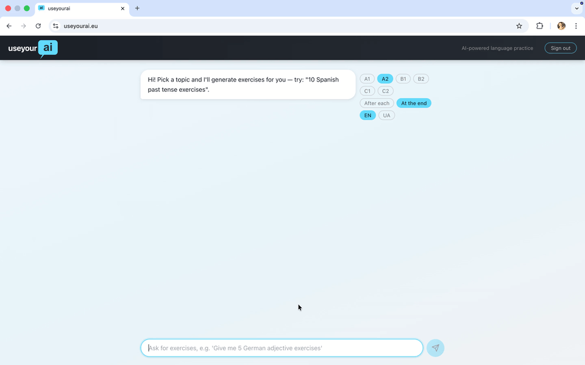

# useyourai

> AI-powered grammar practice, on demand — describe what you want to practice, get exercises, get feedback.

`useyourai` is a serverless language learning app that generates personalized grammar exercises through a chat interface. Type a free-text prompt, get a structured exercise set from Claude Sonnet, answer one by one, and receive AI-generated feedback. When you're done, retry the exercises you got wrong — Claude generates a new set targeting your specific mistakes.

**Live:** [useyourai.eu](https://useyourai.eu) · **Dev:** [dev.useyourai.eu](https://dev.useyourai.eu)



---

## Features

- **On-demand exercise generation** — describe a topic in plain text (e.g. _"10 sentences to practice German accusative case at B2 level"_) and Claude generates a structured, level-calibrated exercise set
- **One-by-one practice** — exercises are presented individually; each answer is evaluated by Claude
- **Configurable feedback** — choose between feedback after every answer or a single summary at the end
- **Retry mistakes** — after completing a session, get a new targeted exercise set focused on what you got wrong
- **Auth with Cognito** — sign up, sign in, and manage your session; access tokens are short-lived (1h) and auto-refreshed
- **Multilingual UI** — English and Ukrainian interface

---

## Architecture

```
Browser (React 18)
  ├─▶ CloudFront ──▶ S3 (static assets)
  └─▶ API Gateway (HTTP + Cognito JWT authorizer)
        ├─▶ POST /session              → create_session Lambda
        ├─▶ POST /session/{id}/answer  → submit_answer Lambda
        └─▶ POST /session/{id}/retry   → retry_session Lambda
                      │
                      ├─▶ AWS Bedrock (Claude Sonnet 4.5, eu-central-1)
                      └─▶ DynamoDB (on-demand, TTL-based cleanup)
```

| Layer    | Technology                                                  |
|----------|-------------------------------------------------------------|
| Frontend | React 18, Axios, Tailwind CSS                               |
| Auth     | AWS Cognito (sign-up/sign-in, JWT, silent token refresh)    |
| Backend  | AWS Lambda (Python 3.11)                                    |
| AI       | AWS Bedrock — `eu.anthropic.claude-sonnet-4-5-20250929-v1:0` |
| Database | DynamoDB (on-demand billing, TTL-based session cleanup)     |
| API      | AWS API Gateway (HTTP, Cognito JWT authorizer)              |
| CDN      | CloudFront + S3 (security headers, HSTS, no-cache config)   |
| IaC      | Terraform + Terraform Cloud (dev + prod workspaces)         |
| CI/CD    | GitHub Actions (OIDC auth, no long-lived AWS credentials)   |

---

## How It Works

**1. Start a session**
Type a free-text prompt — e.g. _"Give me 5 exercises on French subjunctive at B1 level"_. The app calls `POST /session` with your prompt, level (A1–C2), and feedback preference. Claude parses the prompt, generates a structured exercise set, and returns the first exercise.

**2. Answer exercises**
Each answer goes to `POST /session/{id}/answer`. Claude evaluates correctness and optionally returns feedback — either after every answer or at the end of the session, depending on your setting.

**3. Retry mistakes**
When the session ends, the app shows what you got wrong. Accept the retry prompt and `POST /session/{id}/retry` sends your mistakes to Claude, which generates a new exercise set specifically targeting them.

---

## Security Practices

A few things baked in that are worth calling out:

- **Prompt injection hardening** — all user-controlled strings are wrapped in XML tags (`<user_prompt>`, `<user_answer>`) before reaching Bedrock, and every system prompt explicitly instructs Claude to treat tagged content as data only. Input lengths are capped before the Bedrock call.
- **JWT-protected API** — all routes require a valid Cognito access token. The Lambda reads `user_id` from JWT claims, never from the request body.
- **CloudFront security headers** — HSTS (2-year max-age), `X-Frame-Options: DENY`, `X-Content-Type-Options: nosniff`, strict CSP.

---

## Project Structure

```
.
├── lambdas/                   # Python Lambda functions (Python 3.11)
│   ├── create_session.py      # POST /session — generate exercises via Claude
│   ├── submit_answer.py       # POST /session/{id}/answer — evaluate answers
│   └── retry_session.py       # POST /session/{id}/retry — targeted retry set
├── ui/                        # React 18 frontend
│   └── src/
│       ├── App.js             # App root, auth state
│       ├── Auth.js            # Sign-up, sign-in, confirm, forgot password
│       ├── Chat.js            # Main chat interface and session logic
│       ├── cognito.js         # Cognito SDK wrapper (token management)
│       └── translations.js    # EN + UK UI strings
├── infra/                     # Terraform
│   ├── modules/               # api_gateway, lambdas, dynamodb, cognito, frontend
│   └── environments/          # dev/, prod/, base/
├── tests/                     # pytest unit tests (moto for DynamoDB mocking)
├── docs/                      # Architecture and schema docs
└── .github/workflows/         # CI/CD: frontend deploy + Lambda tests
```

---

## Local Development

### Prerequisites

- Node.js 18+
- Python 3.11+

### Frontend

Copy `ui/public/config.js.example` to `ui/public/config.js` and fill in your API Gateway URL and Cognito pool details:

```bash
cp ui/public/config.js.example ui/public/config.js
# edit config.js with your values
cd ui && npm install && npm start
```

The dev server runs on [http://localhost:3000](http://localhost:3000). The app reads `window.ENV` from `config.js` at runtime — this file is never committed (it's generated by CI/CD at deploy time).

### Lambda tests

```bash
pip install -r requirements-dev.txt
pytest
```

Tests use [moto](https://github.com/getmoto/moto) to mock DynamoDB and `unittest.mock` for Bedrock — no AWS credentials needed.

---

## Deployment

Infrastructure is managed by **Terraform Cloud** — do not run `terraform apply` locally.

The CI/CD pipeline:
1. On push to `main` (changes to `ui/**`): GitHub Actions builds the React app and syncs it to S3, then invalidates the CloudFront cache. API URL and Cognito config are fetched from Terraform Cloud state outputs and injected into `config.js` at build time — nothing is hardcoded.
2. Lambda code is deployed by Terraform when source files change (via a new TFC plan run triggered by a PR).
3. Production deploys are manual (`workflow_dispatch` only).
4. AWS authentication uses GitHub Actions OIDC — no long-lived credentials stored anywhere.

> [!NOTE]
> To deploy your own instance, you need a Terraform Cloud account, an AWS account, and a domain in Route53. Fork the repo, update the org/workspace names in `infra/environments/*/backend.tf`, set the required GitHub Actions secrets (`TFC_TOKEN`, `AWS_ROLE_ARN`) and variables (`TFC_WORKSPACE_DEV`, `TFC_WORKSPACE_PROD`), and run a plan from Terraform Cloud.

---

## Roadmap

- [x] Exercise generation (Claude Sonnet via Bedrock)
- [x] Answer evaluation with per-answer and end-of-session feedback modes
- [x] Retry mistakes — targeted exercise sets from wrong answers
- [x] Cognito auth — sign-up, sign-in, silent token refresh
- [x] Production environment (useyourai.eu)
- [x] CloudFront hardening (security headers, HSTS, S3 public access block)
- [ ] CloudWatch structured logging across all Lambdas
- [ ] API Gateway rate limiting
- [ ] User study history and per-topic statistics

---

## Contributing

See [CONTRIBUTING.md](CONTRIBUTING.md).

---

## License

[MIT](LICENSE)
